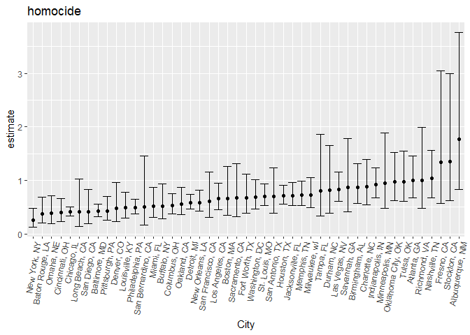
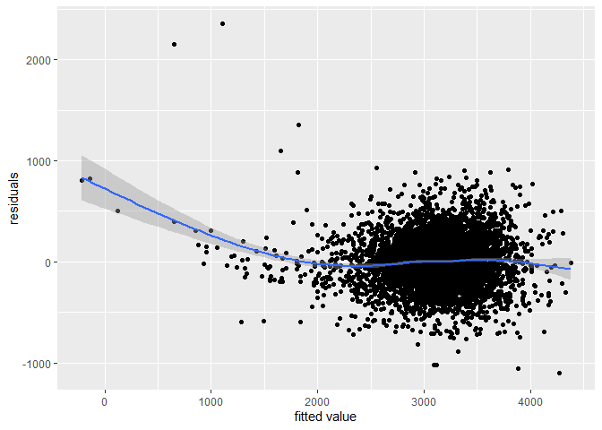
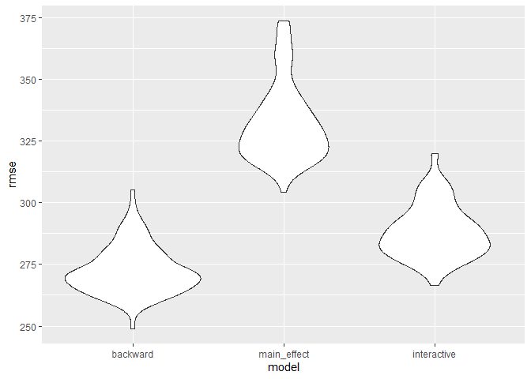

131
================
ht2611
2022-12-02

## 2

``` r
library(tidyverse)
```

    ## ── Attaching packages ─────────────────────────────────────── tidyverse 1.3.2 ──
    ## ✔ ggplot2 3.3.6      ✔ purrr   0.3.4 
    ## ✔ tibble  3.1.8      ✔ dplyr   1.0.10
    ## ✔ tidyr   1.2.0      ✔ stringr 1.4.1 
    ## ✔ readr   2.1.2      ✔ forcats 0.5.2 
    ## ── Conflicts ────────────────────────────────────────── tidyverse_conflicts() ──
    ## ✖ dplyr::filter() masks stats::filter()
    ## ✖ dplyr::lag()    masks stats::lag()

``` r
library(modelr)
library(dbplyr)
```

    ## 
    ## 载入程辑包：'dbplyr'
    ## 
    ## The following objects are masked from 'package:dplyr':
    ## 
    ##     ident, sql

# tidy the data

``` r
homocide = read_csv("data/homicide-data.csv")
```

    ## Rows: 52179 Columns: 12
    ## ── Column specification ────────────────────────────────────────────────────────
    ## Delimiter: ","
    ## chr (9): uid, victim_last, victim_first, victim_race, victim_age, victim_sex...
    ## dbl (3): reported_date, lat, lon
    ## 
    ## ℹ Use `spec()` to retrieve the full column specification for this data.
    ## ℹ Specify the column types or set `show_col_types = FALSE` to quiet this message.

``` r
tidydata=homocide%>%
  mutate(city_state = str_c(city, ", ", state)) %>% 
  filter(!city_state %in% c("Dallas, TX","Phoenix, AZ","Kansas City,MO","Tulsa, AL")) %>% 
  filter(victim_race %in% c("White","Black")) %>%
  filter(!victim_age=="Unknown",
         !victim_sex=="Unknown")%>%
  mutate(solved_state= as.numeric(disposition == "Closed by arrest"))%>%
  mutate(victim_age = as.numeric(victim_age),
         victim_sex = ifelse(victim_sex=="Male",1,0))
```

## fit regression

``` r
fit_logistic = 
  tidydata %>% 
  filter(city_state=="Baltimore, MD") %>%
  glm(solved_state ~ victim_age + victim_race + victim_sex, data = .,   family = binomial()) 
```

``` r
fit_logistic%>%
  broom::tidy()%>%
  mutate(lower_conf = confint(fit_logistic)[,1],
         upper_conf = confint(fit_logistic)[,2])%>%
  filter(term=='victim_sex') %>% 
  select(estimate, lower_conf, upper_conf) %>% 
  mutate(estimate = exp(estimate),
         lower_conf = exp(lower_conf),
         upper_conf = exp(upper_conf))
```

    ## Waiting for profiling to be done...
    ## Waiting for profiling to be done...

    ## # A tibble: 1 × 3
    ##   estimate lower_conf upper_conf
    ##      <dbl>      <dbl>      <dbl>
    ## 1    0.426      0.324      0.558

So keeping all other variables fixed, because estimates is smaller than
1, man has a lower chance to get a resloved case.

# other city

``` r
all_city = 
  tidydata %>% 
  select(city_state, victim_race:victim_sex, solved_state) %>% 
  nest(data = victim_race:solved_state) %>% 
  mutate(
   fit = map(data, ~glm(solved_state ~ victim_age+victim_race+victim_sex, family= binomial(), data=.x)),
   results = map(fit, broom::tidy),
   conf_int = map(fit, ~confint(.x,"victim_sex"))
  ) %>% 
  select(city_state,results,conf_int) %>% 
  unnest(results)%>%
  unnest_wider(conf_int)%>%
  filter(term=="victim_sex") %>% 
  select(city_state,estimate,`2.5 %`,`97.5 %`) %>% 
  mutate(
    estimate=exp(estimate),
    `2.5 %` =exp(`2.5 %`),
    `97.5 %` = exp(`97.5 %`)
    )
```

    ## Waiting for profiling to be done...
    ## Waiting for profiling to be done...
    ## Waiting for profiling to be done...
    ## Waiting for profiling to be done...
    ## Waiting for profiling to be done...
    ## Waiting for profiling to be done...
    ## Waiting for profiling to be done...
    ## Waiting for profiling to be done...
    ## Waiting for profiling to be done...
    ## Waiting for profiling to be done...
    ## Waiting for profiling to be done...
    ## Waiting for profiling to be done...
    ## Waiting for profiling to be done...
    ## Waiting for profiling to be done...
    ## Waiting for profiling to be done...
    ## Waiting for profiling to be done...
    ## Waiting for profiling to be done...
    ## Waiting for profiling to be done...
    ## Waiting for profiling to be done...
    ## Waiting for profiling to be done...
    ## Waiting for profiling to be done...
    ## Waiting for profiling to be done...
    ## Waiting for profiling to be done...
    ## Waiting for profiling to be done...
    ## Waiting for profiling to be done...
    ## Waiting for profiling to be done...
    ## Waiting for profiling to be done...
    ## Waiting for profiling to be done...
    ## Waiting for profiling to be done...
    ## Waiting for profiling to be done...
    ## Waiting for profiling to be done...
    ## Waiting for profiling to be done...
    ## Waiting for profiling to be done...
    ## Waiting for profiling to be done...
    ## Waiting for profiling to be done...
    ## Waiting for profiling to be done...
    ## Waiting for profiling to be done...
    ## Waiting for profiling to be done...
    ## Waiting for profiling to be done...
    ## Waiting for profiling to be done...
    ## Waiting for profiling to be done...
    ## Waiting for profiling to be done...
    ## Waiting for profiling to be done...
    ## Waiting for profiling to be done...
    ## Waiting for profiling to be done...
    ## Waiting for profiling to be done...
    ## Waiting for profiling to be done...

``` r
all_city
```

    ## # A tibble: 47 × 4
    ##    city_state      estimate `2.5 %` `97.5 %`
    ##    <chr>              <dbl>   <dbl>    <dbl>
    ##  1 Albuquerque, NM    1.77    0.825    3.76 
    ##  2 Atlanta, GA        1.00    0.680    1.46 
    ##  3 Baltimore, MD      0.426   0.324    0.558
    ##  4 Baton Rouge, LA    0.381   0.204    0.684
    ##  5 Birmingham, AL     0.870   0.571    1.31 
    ##  6 Boston, MA         0.667   0.351    1.26 
    ##  7 Buffalo, NY        0.521   0.288    0.936
    ##  8 Charlotte, NC      0.884   0.551    1.39 
    ##  9 Chicago, IL        0.410   0.336    0.501
    ## 10 Cincinnati, OH     0.400   0.231    0.667
    ## # … with 37 more rows

# plot

``` r
ggplot(all_city, aes(x=fct_reorder(city_state, estimate), y=estimate))+
  geom_point()+
  geom_errorbar(aes(ymin=`2.5 %`, ymax=`97.5 %`))+
  labs(title = "homocide")+xlab("City")+
  theme(axis.text.x = element_text(angle = 80, hjust = 1))
```

<!-- -->

Most cities’ estimate are smaller than 1. It means that in most cities,
men have lower chance to get a resloved case. For those cities that even
the upper bound is smaller than 1, there exists a gender differece when
the police finish the case.

## 3

``` r
birthweight = read_csv("data/birthweight.csv")
```

    ## Rows: 4342 Columns: 20
    ## ── Column specification ────────────────────────────────────────────────────────
    ## Delimiter: ","
    ## dbl (20): babysex, bhead, blength, bwt, delwt, fincome, frace, gaweeks, malf...
    ## 
    ## ℹ Use `spec()` to retrieve the full column specification for this data.
    ## ℹ Specify the column types or set `show_col_types = FALSE` to quiet this message.

``` r
tidydata1 = 
  birthweight %>% 
  mutate(
    frace = recode(frace, `1` = "White", `2` = "Black", `3` = "Asian", `4`= "Puerto Rican", `8` = "Other", `9` = "Unknown"),
    mrace = recode(mrace, `1` = "White", `2` = "Black", `3` = "Asian", `4`= "Puerto Rican", `8` = "Other"),
    babysex = recode(babysex, `1` = "Male", `2` = "Female")
    )%>% 
  filter(frace!="Unknown")
```

To begin with, we select all variables. Then, we use backward regression
to select important variables.

``` r
full_model <- lm(bwt ~., data = tidydata1)
backward_model <- MASS::stepAIC(full_model, direction = "backward", trace = FALSE)
summary(backward_model)
```

    ## 
    ## Call:
    ## lm(formula = bwt ~ babysex + bhead + blength + delwt + fincome + 
    ##     gaweeks + mheight + mrace + parity + ppwt + smoken, data = tidydata1)
    ## 
    ## Residuals:
    ##      Min       1Q   Median       3Q      Max 
    ## -1097.18  -185.52    -3.39   174.14  2353.44 
    ## 
    ## Coefficients:
    ##                     Estimate Std. Error t value Pr(>|t|)    
    ## (Intercept)       -6145.1507   141.9496 -43.291  < 2e-16 ***
    ## babysexMale         -28.5580     8.4549  -3.378 0.000737 ***
    ## bhead               130.7770     3.4466  37.944  < 2e-16 ***
    ## blength              74.9471     2.0190  37.120  < 2e-16 ***
    ## delwt                 4.1067     0.3921  10.475  < 2e-16 ***
    ## fincome               0.3180     0.1747   1.820 0.068844 .  
    ## gaweeks              11.5925     1.4621   7.929 2.79e-15 ***
    ## mheight               6.5940     1.7849   3.694 0.000223 ***
    ## mraceBlack          -63.9057    42.3663  -1.508 0.131523    
    ## mracePuerto Rican   -25.7914    45.3502  -0.569 0.569578    
    ## mraceWhite           74.8868    42.3146   1.770 0.076837 .  
    ## parity               96.3047    40.3362   2.388 0.017004 *  
    ## ppwt                 -2.6756     0.4274  -6.261 4.20e-10 ***
    ## smoken               -4.8434     0.5856  -8.271  < 2e-16 ***
    ## ---
    ## Signif. codes:  0 '***' 0.001 '**' 0.01 '*' 0.05 '.' 0.1 ' ' 1
    ## 
    ## Residual standard error: 272.3 on 4328 degrees of freedom
    ## Multiple R-squared:  0.7181, Adjusted R-squared:  0.7173 
    ## F-statistic: 848.1 on 13 and 4328 DF,  p-value: < 2.2e-16

# plot

``` r
tidydata1 %>% 
  add_predictions(backward_model) %>% 
  add_residuals(backward_model) %>% 
  ggplot(aes(x = pred, y = resid)) + geom_point() + 
  geom_smooth()+
  xlab("fitted value")+ylab("residuals")
```

    ## `geom_smooth()` using method = 'gam' and formula 'y ~ s(x, bs = "cs")'

<!-- -->

# comparsion

``` r
cv_df =
  crossv_mc(tidydata1, 100) %>% 
  mutate(
    train = map(train, as_tibble),
    test = map(test, as_tibble))
```

``` r
cv_df = 
  cv_df %>% 
  mutate(
    backward_model  = map(train, ~lm( bwt ~ babysex + bhead + blength +   delwt +fincome + gaweeks + mheight + mrace +parity + ppwt + smoken, data  = .x)),
    main_effect_model  = map(train, ~lm(bwt ~ gaweeks + blength, data =   .x)),
    interactive_model  = map(train, ~lm(bwt ~ bhead*blength*babysex, data = .x))) %>% 
  mutate(
    rmse_backward = map2_dbl(backward_model, test, ~rmse(model = .x, data = .y)),
    rmse_main_effect  = map2_dbl(main_effect_model, test, ~rmse(model =   .x, data = .y)),
    rmse_interactive = map2_dbl(interactive_model, test, ~rmse(model = .x, data = .y)))
cv_df %>% 
  select(starts_with("rmse")) %>% 
  pivot_longer(
    everything(),
    names_to = "model", 
    values_to = "rmse",
    names_prefix = "rmse_") %>% 
  mutate(model = fct_inorder(model)) %>% 
  ggplot(aes(x = model, y = rmse)) + geom_violin()
```

<!-- -->

As we can see from the plot, the model selected by backward has the
lowest rmse. Interactive model is better than main_effect model.
